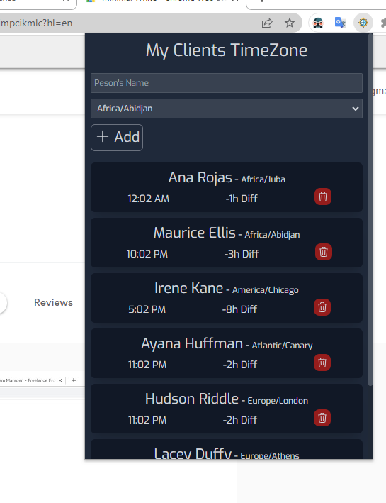

# "My Clients TimeZone" Chrome Extension

## Description

"My Clients TimeZone" Extension is a handy tool designed to help remote freelancers and teams easily calculate the time difference between different time zones. It allows you to keep track of your team members' local time and ensure effective collaboration across different regions.

## Features

- Add and manage clients names and time zones
- Display the current time and time difference for each client
- Remove clients as needed

## Installation

1. download file "build" the source code as a ZIP file.
2. Open the Chrome browser and go to `chrome://extensions`.
3. Enable the "Developer mode" toggle switch.
4. Click on "Load unpacked" and select the project folder.
5. The extension should now be installed and visible in the browser toolbar.

## License

This project is licensed under the [MIT License](LICENSE).

---

Developed by [Youssef Mahboub](https://github.com/youssefmahboub)

